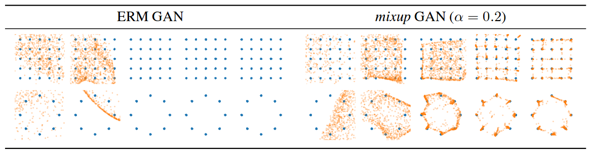

This repo contains demo reimplementations of the CIFAR-10 training code and the GAN experiment in PyTorch based on the following paper:
> Hongyi Zhang, Moustapha Cisse, Yann N. Dauphin and David Lopez-Paz. _mixup: Beyond Empirical Risk Minimization._ https://arxiv.org/abs/1710.09412

## CIFAR-10

The following table shows the median test errors of the last 10 epochs in a 200-epoch training session. (Please refer to Section 3.2 in the paper for details.)

| Model              | weight decay = 1e-4  | weight decay = 5e-4  |
|:-------------------|---------------------:|---------------------:|
| ERM                |               5.53%  |               5.18%  |
| _mixup_            |               4.24%  |               4.68%  |

## Generative Adversarial Networks (GAN)

## Other frameworks
 - [A Tensorflow implementation of mixup](https://github.com/ppwwyyxx/tensorpack/tree/master/examples/ResNet#cifar10-preact18-mixuppy) which reproduces our results in [tensorpack](https://github.com/ppwwyyxx/tensorpack)

## Acknowledgement
The CIFAR-10 reimplementation of _mixup_ is adapted from the [pytorch-cifar](https://github.com/kuangliu/pytorch-cifar) repository by [kuangliu](https://github.com/kuangliu).
