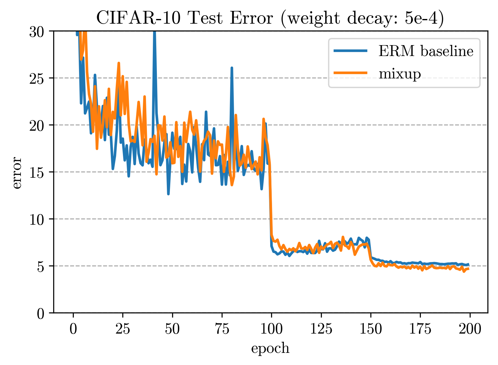

# mixup training for CIFAR-10

## Training
```bash
# training with default parameters (weight_decay=1e-4 and alpha=1)
python easy_mixup.py --sess my_session_1 --seed 11111
```
The above bash script will download the CIFAR data and train the network with 1e-4 weight decay and mixup parameter alpha=1.0; alternatively, we can experiment with other weight decay and alpha value using corresponding options:
```bash
# training with weight_decay=5e-4 and alpha=0 (no mixup)
python easy_mixup.py --sess my_session_2 --seed 22222 --decay 5e-4 --alpha 0.
```
The other choices (network architecture, #epochs, learning rate schedule, momentum, data augmentation etc.) are hard coded but modifications are hopefully straightfoward.

By default, the trained model with the best validation accuracy resides in `./checkpoint` folder, and the training log (including training loss/accuracy and validation loss/accuracy for each epoch) is saved in `./results` as a `.csv` file.

## Results
**_mixup_ reduces overfitting and improves generalization.** The following plots show test error curves of a typical training session using the PreAct ResNet-18 architecture (default; you can make changes [here](https://github.com/hongyi-zhang/mixup/blob/8b43d663501b10ccb8e21d88be9d42d3bab0fd2f/easy_mixup.py#L78)). Note that compared with the ERM baseline, **_mixup_ prefers a smaller weight decay** (1e-4 vs. 5e-4), indicating its regularization effects.

| Model              | weight decay = 1e-4  | weight decay = 5e-4  |
|:-------------------|---------------------:|---------------------:|
| ERM                |               5.53%  |               5.18%  |
| _mixup_            |               4.24%  |               4.68%  |




## Other frameworks
 - [A Tensorflow implementation of mixup](https://github.com/ppwwyyxx/tensorpack/tree/master/examples/ResNet#cifar10-preact18-mixuppy) which reproduces our results in [tensorpack](https://github.com/ppwwyyxx/tensorpack)

## Acknowledgement
This reimplementation is adapted from the [pytorch-cifar](https://github.com/kuangliu/pytorch-cifar) repository by [kuangliu](https://github.com/kuangliu).
